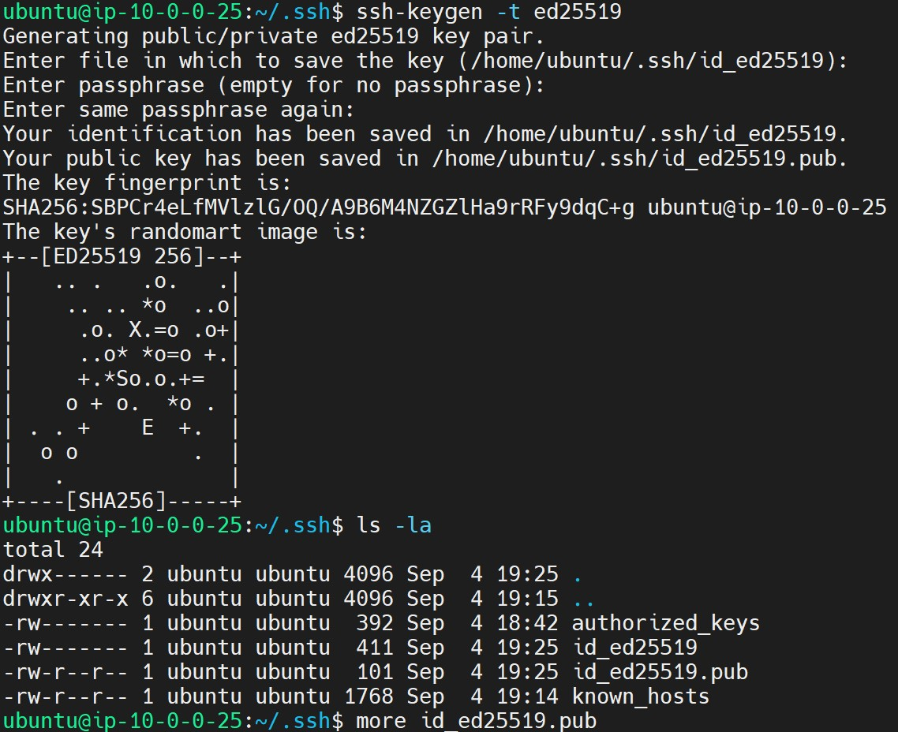
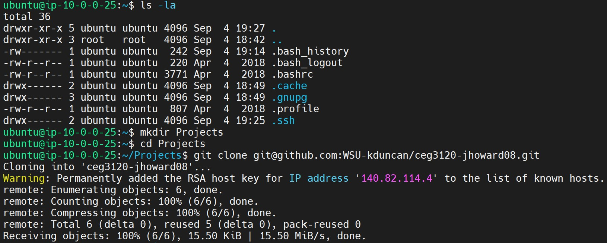
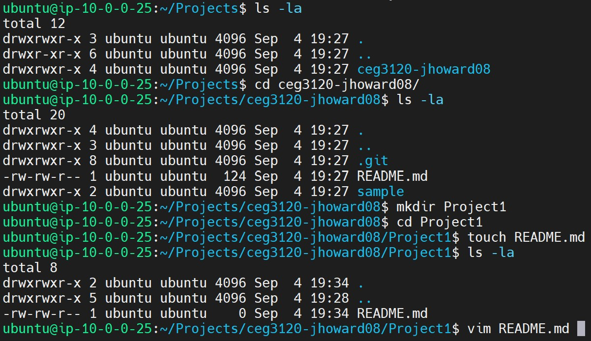
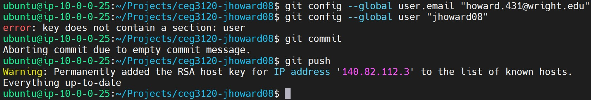

# How to stand-up a Git repository inside an AWS instance.

# Login to AWS
*Entering AWS instance from ubuntu (WSL2 terminal).
1. Have the AWS instance initialized and running at the time said user wants to connect.
2. Ensure there is a private SSH key that has been passed from the AWS instance in a .ssh DIR or DIR said user will readily identify.
3. Login to the AWS instance using "ssh -i <ssh-keygen> -C ubuntu@AWS_Instance_IP".
* For example "ssh -i ceg3120-aws-vm-2.pem -C ubuntu@52.23.191.201" (This is my AWS_instance_IP)

# Connect GitHub to AWS.
# Run the CMD(s):
1. "cd .ssh"
# Create a separate set of keypair for the ubuntu system in AWS
2. "ssh-keygen -t ed25519"
* ***GO_WITH_DEFAULTS_FOR_FOLLOWING_QUESTIONS***
# End result:

# Standup Git Repository.
# Run the CMD(s):
# Make a new directory that is NOT HOME.
1. "mkdir <DIR_NAME>"
# Change the current directory to the newly allocated DIR.
2. "cd <DIR_NAME> "
# Initialize a local instance of a Git repository.
3. "git init"
# Clone existing repository into local instance or cd to another directory...
4. "git clone  <git@github.com:<WSU-kduncan/ceg3120-<YOUR_NAME>.git>"
* For example "git clone git@github.com:WSU-kduncan/ceg3120-jhoward08.git" (This is my Git repository)

# Make a DIR "Project1" within the current directory.
# Run the CMD(s):
# Change to new directory.
1. "cd Project1"
# Create a file named README.md
2. "touch README.md"
# Open the file in an editor (vim, vi, nano, gedit, etc.)
3. "vim README.md"
# Continue working . . .
# Write(save) and Quit the file.
4. ":wq"

# There is now a file REAME.md in the folder of the directory which the git repo instance was created.
# Now the file(s) and any directories necessary must be added to the git repository.

# Adding files/DIR(s) to a Git repo.
# Run the CMD(s)
1. "git add <FILES_or_DIR(s)>"
# Commit the change to the Git repo.
2. "git commit"
# This will pull-up an editor allowing a user to input any necessary comments relating to this commit.
3. Input comment(s) for commit reason, then save and exit editor.
# Push said changes to the Git repo master branch.
4. "git push"

