# Discord-Bot README
-Where to start? Right here! Below is a list of instructions from making a server on discord, to making a bot.
1. Make sure you have a Discord Account (if you need the link it is below this line).
* www.discord.com
------------------------------------------------------------------------------------
2. After making an account or logging in, proceed to the Developer Portal home page.
* "https://discord.com/developers/applications"
------------------------------------------------------------------------------------
3. Create a New Application. 
* In the top right corner of the page, you will see a button called "New Application"; Click this and call it a name when the popup presents itself.
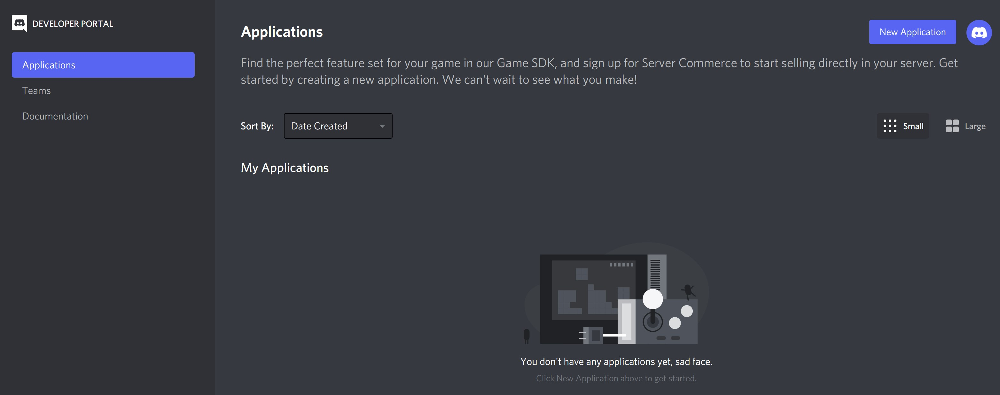
* After making a new application you will see a new page with the name of your application and a list of traits.
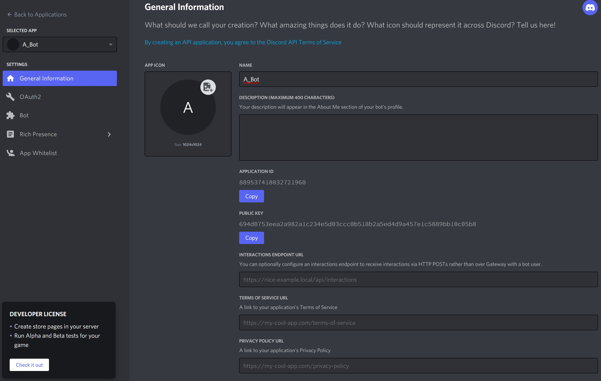
********************************NOTE********************************
"Keep in mind that any program that interacts with Discord APIs requires a Discord application, not just bots. Bot-related APIs are only a subset of Discord’s total interface.

However, since this tutorial is about how to make a Discord bot, navigate to the Bot tab on the left-hand navigation list."
Taken from "https://realpython.com/how-to-make-a-discord-bot-python/" 
------------------------------------------------------------------------------------
4. Make a BOT! 
* To make a bot, click on "Add Bot" on the right hand side of the Bot page.
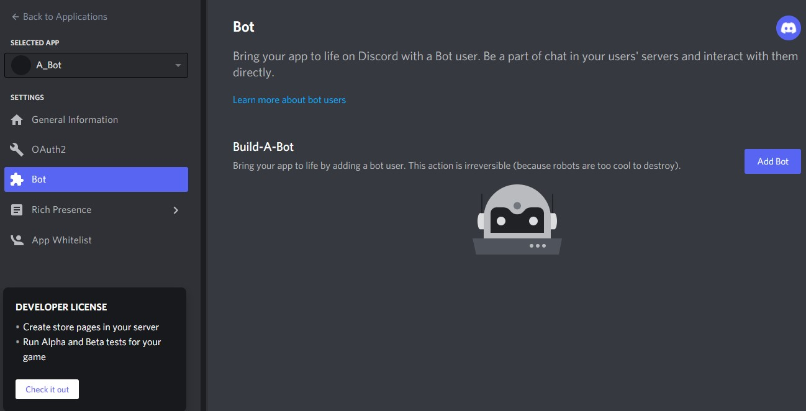
* You should see something like this:
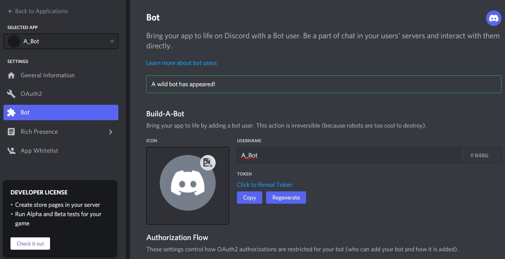
* You can change the name of the bot from this page by changing the username to something other than the application name (Also, feel free to add a picture too!) then save changes.
.jpg)
** Photo courteousy of: "https://www.avenga.com/magazine/ai-future-gpt-3/" 
------------------------------------------------------------------------------------
5. Create a Guild (Server). 
* Now you have to create a Guild (Server) to have the bot interact with other users. To do this go to the Discord server main page (it looks like a chatroom).
* Click the plus sign on the left-hand side of the page and input a name for the new Guild (Server).
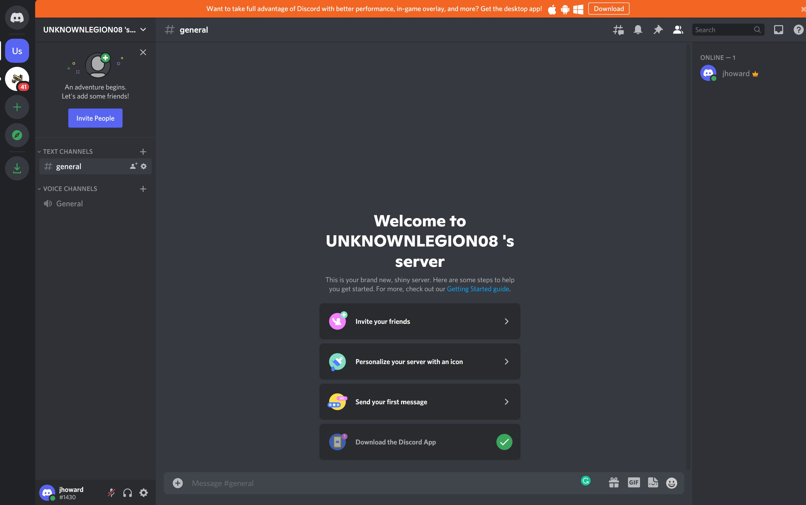
------------------------------------------------------------------------------------
6. Add Bot to Server (Guild).
* To add a bot to the Guild, the server needs an OAUTH2 protocol for authorizing the bot to use the space. Go ahead and go back to Discord's Developer Portal and click on the OAuth2 tab on the left side of the page.
* On the OAuth2 page of the Discord Developer Portal there is a authorization generator which will need specific permissions added or removed based upon what the bot is supposed to be able to do. There are check boxes with explanations next to them for easy reference and application.
* Under Scopes, add bot by clicking the appropriate checkbox, then scroll further down and under bot permissions (Which should've shown-up after adding bot to Scopes), then add Administrator to the bot permissions using the checkbox.
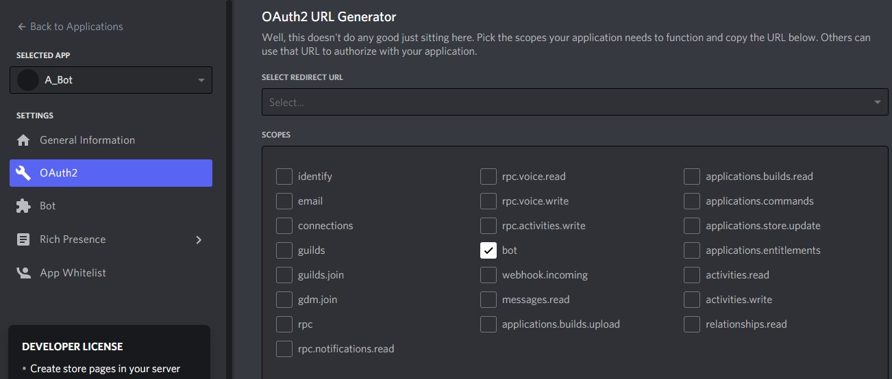
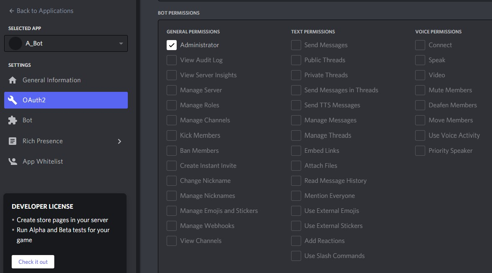
* Now that the authorization is setup, lets copy the link of the Bot Auth using the copy button just above Bot Permissions, inside of the Scopes portion.

* Place the URL into a browser and click the dropdown to select which server the bot will have permission on, and click Authorize.
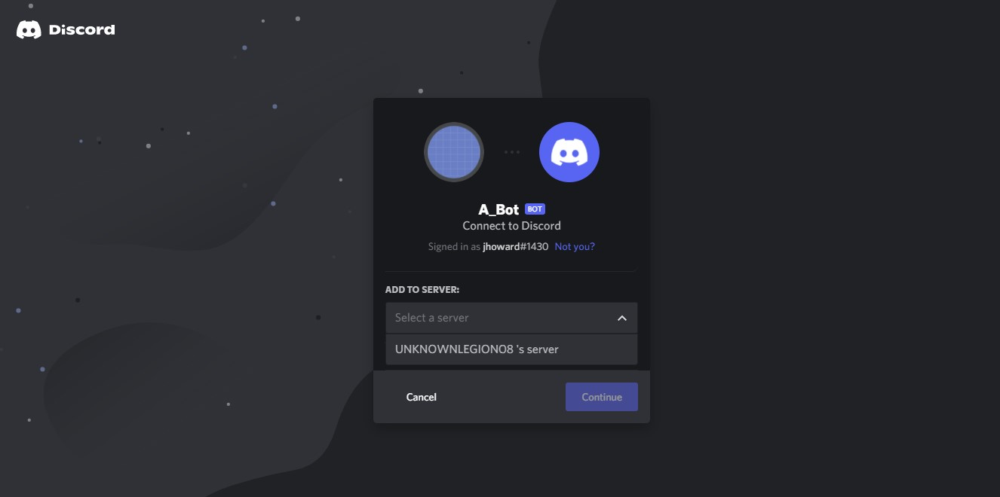
* On the Guild page there should now be a bot that was created and attached to the Guild.

"In summary, you’ve created:

An application that your bot will use to authenticate with Discord’s APIs
A bot user that you’ll use to interact with other users and events in your guild
A guild in which your user account and your bot user will be active
A Discord account with which you created everything else and that you’ll use to interact with your bot
Now, you know how to make a Discord bot using the Developer Portal. Next comes the fun stuff: implementing your bot in Python!"
** Taken from "https://realpython.com/how-to-make-a-discord-bot-python/" 
------------------------------------------------------------------------------------
Now to make a Bot with Python!

1. Let's start by installing the necessary programs and libraries to run the bot.
* Log into the AWS instance as the ubuntu user and locate the home directory.
* The "realpython.com" site says to use "pip install -U discord.py", but we are going to perform the command(s):
"apt install -U python python3 pip3" (Don't forget to add sudo to the beginning of the command if not running as root user).
* Now the user should be able to run the command "pip3 install -U discord.py".
* Output will look like this:
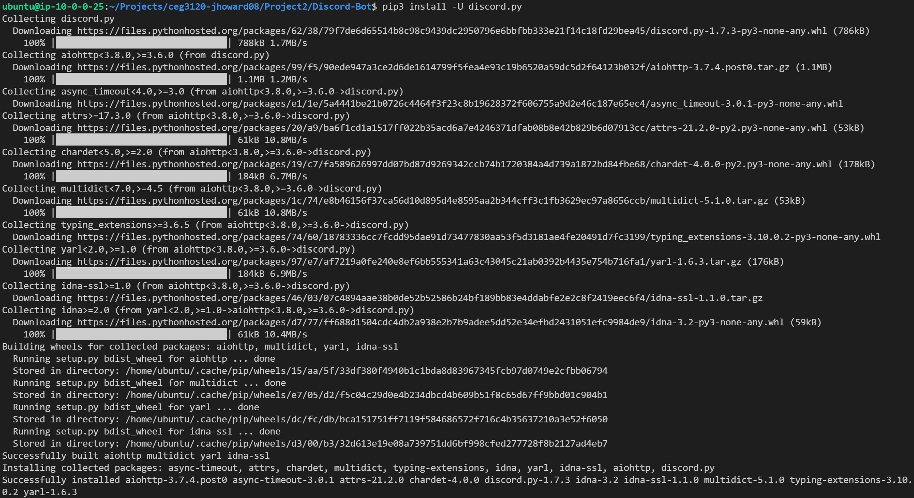
* Now the user needs to run the command "pip3 install -U python-dotenv" to install the library to deal with .env files.
* Output will look like this:
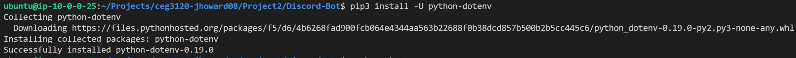
* In your local Git repository on the AWS instance add a file named ".gitignore". This file is going to keep any secrets or unwanted files
  from being added to your Global repository.
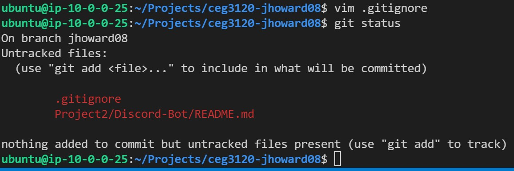
------------------------------------------------------------------------------------
2. First thing to do is create a new branch separate from "main or master" branch.
* This is done by using the command "git branch <BRANCH_NAME>" (The user can check if the branch was created by using the "git branch" command as is).
* Follow (don't pipe) the last command with "git checkout <BRANCH_NAME>" (The user can see that the branch has been changed by the auto-output).
********************************NOTE********************************
* The branch is an added layer of protection for any user working with repositories. It allows an exact copy of the "main or master" repo and changes to be made to the new branch without affecting the "main or master" branch until a merge is commanded.
------------------------------------------------------------------------------------
3. Add Project2, README.md, etc. . . 
* From the Project directory with your local git repository, add the directory Project2 with "mkdir Project2/Discord-Bot" and change DIR to the newly made DIR.
* Add a file using "cat bot.py", "touch bot.py", or "vim bot.py".
* Add a file using any of the above commands, but call it ".env" in the same directory.
** The .env file is going to hold the DISCORD_TOKEN and GUILD_NAME. This .env file needs to be added to the .gitignore file in the higher directory of the Git repository.
* The .gitignore file should look something like this:

------------------------------------------------------------------------------------
4. Add the Discord Token to the necessary file.
* Change directories to the "Project2/Discord-Bot" and open the .env file.
* From the Discord Developers Bot page, the user will need to click the copy button under token to place in the .env file as     "DISCORD_TOKEN=<USER_BOT_TOKEN>" and add "DISCORD_GUILD=<USER_GUILD_NAME>" right under the DISCORD_TOKEN, then save the .env file.
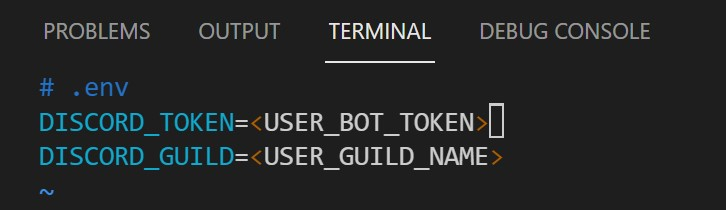
------------------------------------------------------------------------------------
5. Now a quick test to see if everything is actually working!
* Go ahead and copy the bot.py source code from "https://github.com/<YOUR_USER_NAME>/Fall2021-CEG3120/blob/main/Projects/Project2/bot.py" into your file bot.py.
* Go into your bot.py file using "vim bot.py" or "vi bot.py" or "nano bot.py" and at the top put "#! /usr/bin/python3". This is needed to ensure that the interpreter is using python3 and not python2 or other versions.
* Then run "python bot.py" and your output should look like this:
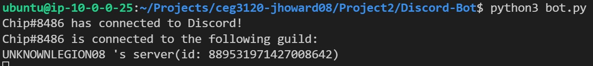
6. Check Guild/Bot status.
* Go to the Guild (Server) in Discord and type "towel!". Output should look like this:
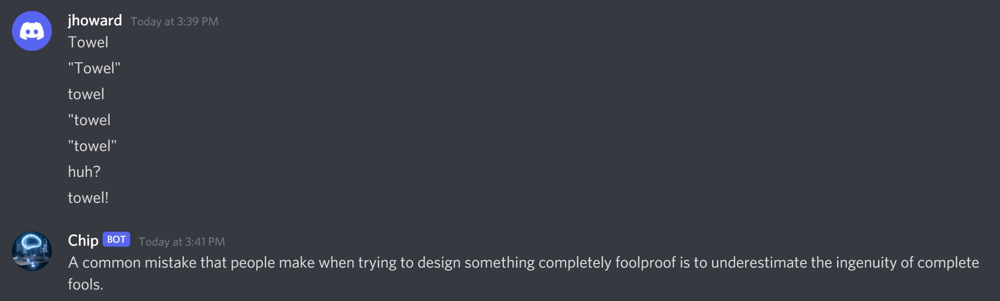
------------------------------------------------------------------------------------
Now that the Bot is up and running we can look at the python code and change a few things to personalize it to our user's tastes.
1. Leave the open instance of the Bot with discord in aws using "CTRL+Z".
2. Open the bot.py file.
* The output (From top to where we stop) will load libraries and other niceties using the "import" and namespace "from<LIB_NAME>" "import<LIB_VAR/FUNCT>":

* We move into the section that is going assign the function/method from the libraries such as:
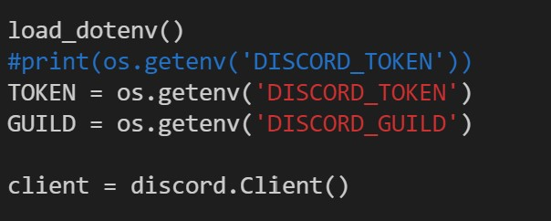
* Then we Actually use the function/method like this:
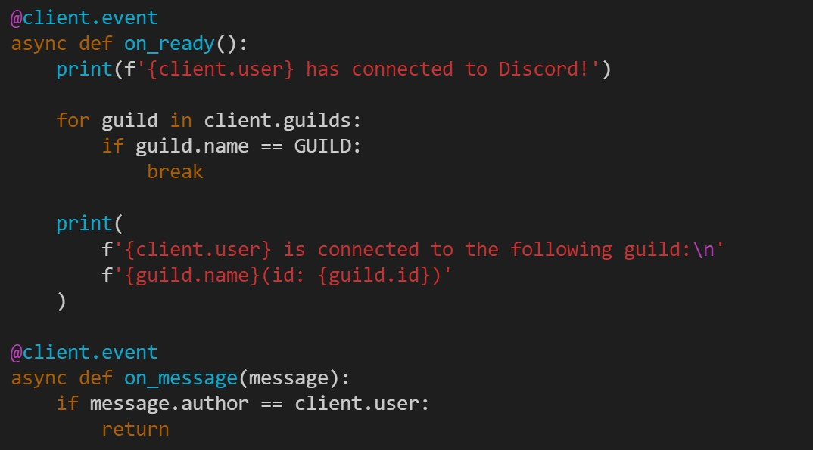
* All of that to setup and use the login as the bot, but now to make the bot do something, we need a function/method that will actually return something like this:

* This is my change to the quotes originally used:
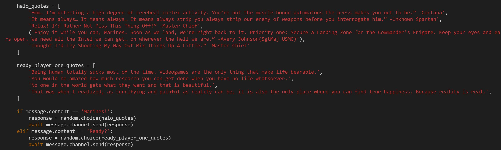
* And this is the new output:

------------------------------------------------------------------------------------
********************************R&D********************************
Since the bot is up and running, you may have found that pictures can be placed in messages as well. I tried to add this with no joy. There are many different routes to accomplish this such as using Discord's Embed functions, or File functions, but I did not have enough time to play with this.
Since we have a bot that is running through an AWS instance (running a Linux VM), we have to start and stop the bot each time we log into our instance. This is just a bit of a hassel since we want the bot to be up an running all the time.
One of the best ways I have found for the bot to run is to use Docker. Docker is a service that runs image(s) inside of a container. The cool thing about this is that you can run an image of any code, the service can run in the forground or background and even have an interactive terminal.
With Docker, the container uses the base kernel of the system which it is running on, which means that there doesn't have to be another operating system running in the container. Containers can be connected to by creating a socket which means that tcp/ip seems like the route we would need the bot to utilize when running from the AWS instance.
Another cool thing about Docker containers is that they have a repository similar to GitHub which can be utilized for upload/download for quick images, passing of images or utilize GitHub. There is an ability in GitHub to create an image repository and have the instance of Docker pull that image to run, much like pulling a repo from GitHub.
