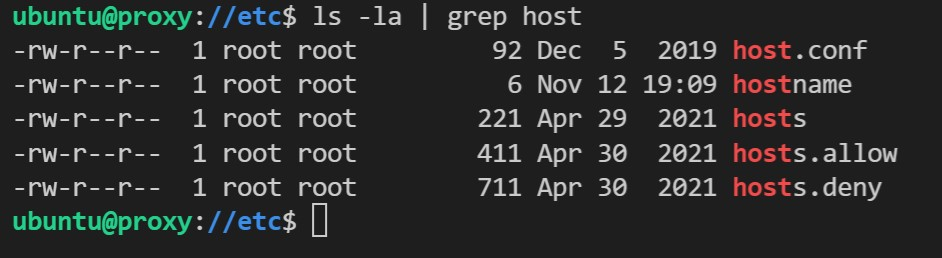
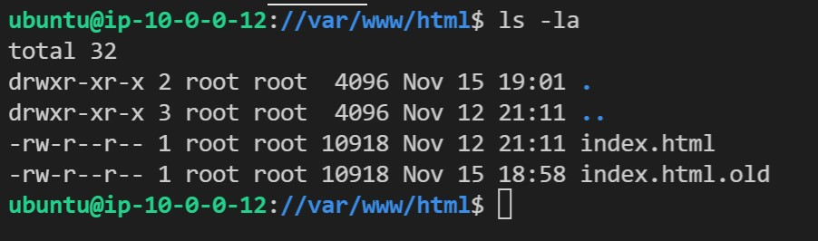

# Project 05 - CF-Template (Proxy & two splash pages)
----------------------------------
1. Get the cf-template.yml
* Login to GitHub
* Using the cf-template from https://github.com/pattonsgirl/Fall2021-CEG3120/tree/main/Projects/Project5
  Add in a new webserver instance at the end by copying and pasting the previous webserv1 instance.
* Pick a unique elastic-ip for both instances as well as the ubuntu instance that will be used as the proxy.

* Once all settings in the yaml file has been set, upload the document into AWS using the Cloud Template creator.

* Clean up any errors that may populate during creation, and then continue to the next step.

----------------------------------
2. Login to the instance "Proxy" to add hosts
* Using ssh, login to the instance that is being used as the Proxy.

* Locate the hosts file in "/etc/".

* Sudo vim into the file of "hosts", here is where you will add the private IP of the other instances
  from WebServ1 and WebServ2 (unless you named them something different), as well as the host names.
  
----------------------------------
3. Login to the instance "WebServ1" and then "WebServ2" to add hosts
* Using ssh, login to the instance(s) "WebServ#", and locate the hosts file like the Proxy instance.

* Find the hosts file and sudo vim into it.

* Rinse and Repeat!

----------------------------------
4. Go back to the users WSL terminal on the user's local machine.
* On the user's local machine, we have a private key that AWS gave us. We now need to add the key to, 
  at the very least, the proxy instance. The WebServer_1 & 2 can be done as well, but for the sake of
  time we will only add it to the proxy instance.

* Using the command "sftp" (secure file transfer protocol), transfer the user's private key to the .ssh
  file of the proxy instance. (If wanted, it can be added to the WebServer_1 & 2 instances as well).

* Now that the private key is located on the proxy instance; Time to test the connection.

----------------------------------
5. Configure the WebServer pages.
* Login to either of the WebServer instances that were created.
* The apache service should have been installed when the instance was created from the template. If not 
  then use the command "sudo apt install apache2" to install the service on both serversS.
* Locate the html file "index" which is usually in the "/var/www/html" folder of Root.

* Input the html script below into both WebServer index pages.

* To check if the changes worked, you can open a browser and input the public ip that was made for server 1 and server 2 which 
  will give you the images below:
  
  
* IF you want to get crazy with it, you can create a new directory in "/var/www" with a name YOU CHOOSE, then make a new index.html
  with it's guts.
* Change directory to "/etc/apache2/sites-available", and make a new file with the name YOU CHOSE for the "/var/www/<NAME>" directory 
  and make it "<NAME>.conf".
* Vim into the file and replace the below screenshot info with your own info:

* You have to now enable the website using the commmand "sudo a2ensite <NAME>.conf" and "sudo a2dissite 000-default.conf" to disable 
  the old index.html pointer.
* reload the apache2 service using "sudo systemctl reload apache2" for the changes to take effect.
----------------------------------
6. Configure HaProxy.
* Login to the proxy instance again. The template should have already installed HaProxy. See below:

* If it did not install, then use the command "sudo apt install haproxy".

* The file we need to modify is the "haproxy.cfg" file.
* Change the directory to "/etc/haproxy" which will have the file above inside it. Use the command 
  "sudo cp haproxy.cfg haproxy.cfg.original" to create a copy incase of error(s) after changing the file.

* Use the command "sudo vim haproxy.cfg" to start configuring the frontend and backend of the config file.
* You should not have to remove anything from the file, but append to the end the snippet below:

* Now you have to restart the HaProxy service using the command "sudo systemctl reload haproxy.service" to
  add in the changes.
----------------------------------
7. CHECK IF IT'S WORKING!
* Open a browser on the user's local machine and input the public IP of the proxy instance that was stood up.
* The output should be as seen below:

