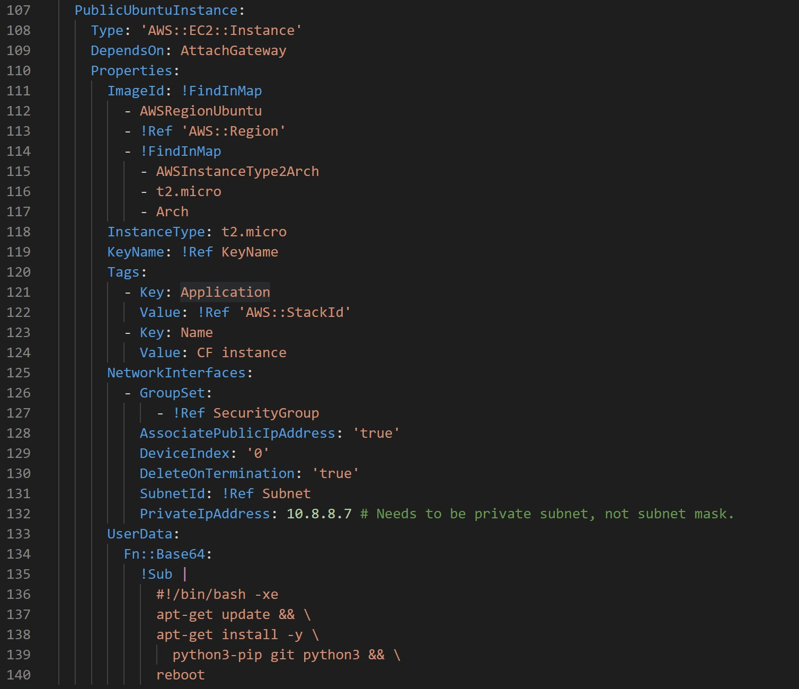

# Project_04 README
Objectives:
* Understand and create a template .yml file that will be uploaded to AWS for automated Cloud Formation
--------------------------------
# Get the template for the automated Cloud Formation
1. Go to the URL below to get the cf-template.yml:
https://github.com/pattonsgirl/Fall2021-CEG3120/blob/main/Projects/Project4/cf-template.yml
* The template provided will be used to upload into Amazon Web Services (AWS) for automated Cloud Formation,
  simlar to Project_03.
--------------------------------
2. Change the "Description" to something relatable.
* When looking at the .yaml file, it can be a bit daunting, but all the "key words (TAGS)" are just basically pointers
  for the AWS script that reads it in, to place in the textboxes for building.
* Under the "Description" I have changed mine to read:

--------------------------------
3. Change the "Mappings: AWSRegionUbunut, Server Zone (if necessary) and HVM".
* I have changed my above keywords to:

--------------------------------
4. Change the "Resources: CidrBlock (for the Virtual Private Cloud), and Value".
* I didn't have to change the CidrBlock, but instead of running with the same instance from Project_03 (just
  in case not everyone deleted their stacks) to show that this script actually builds the CF to specification.
* I did however need to change the "Value" keyword from CEG 2350 to reflect CEG 3120.
* Below is my changed Resource block of the .yaml file:

--------------------------------
5. Change the "Subnet: CidrBlock"
* I made mine different again than Project_03 to ensure a real build.

--------------------------------
6. Add in the network that the user will be accessing the instance from with ssh / port 22.
* Mine was added in just below the WSU CIDR:

--------------------------------
7. Change the "Value" tag under the "Name" tag to reflect "CF Instance".
* Below is what my file reflects:

--------------------------------
8. Login to the instance after creation.
* Below is the login to my instance from the cf-template.

